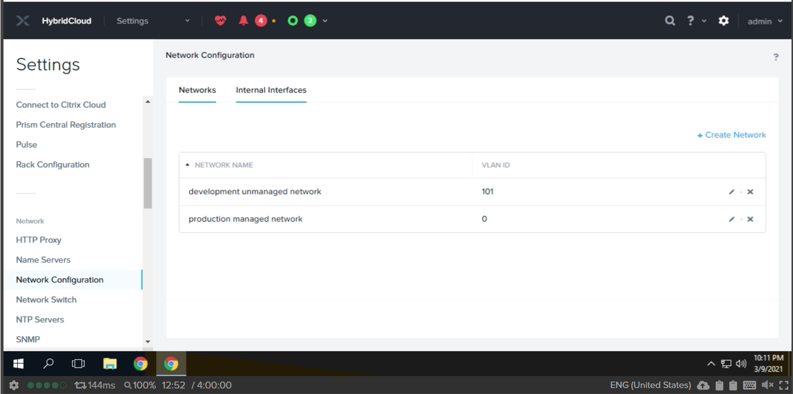
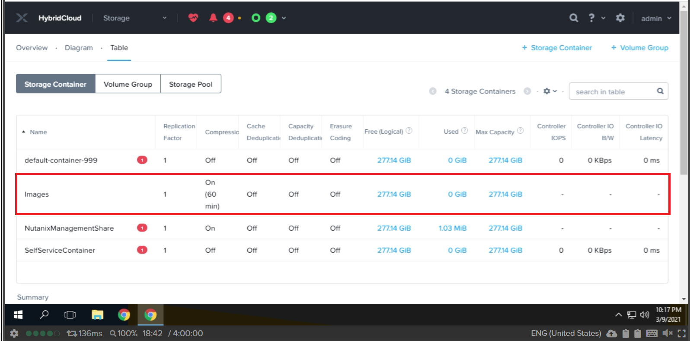
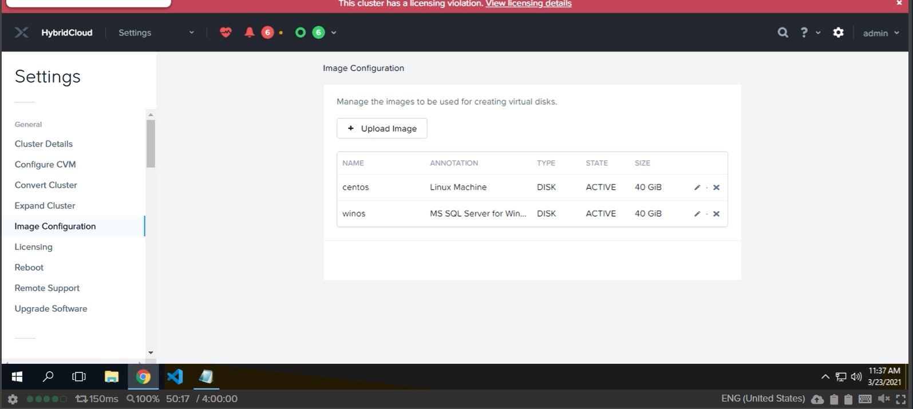
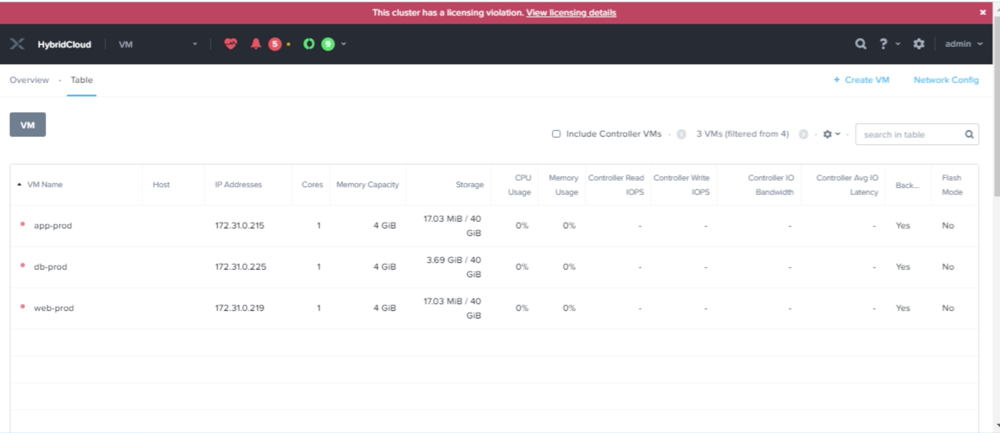
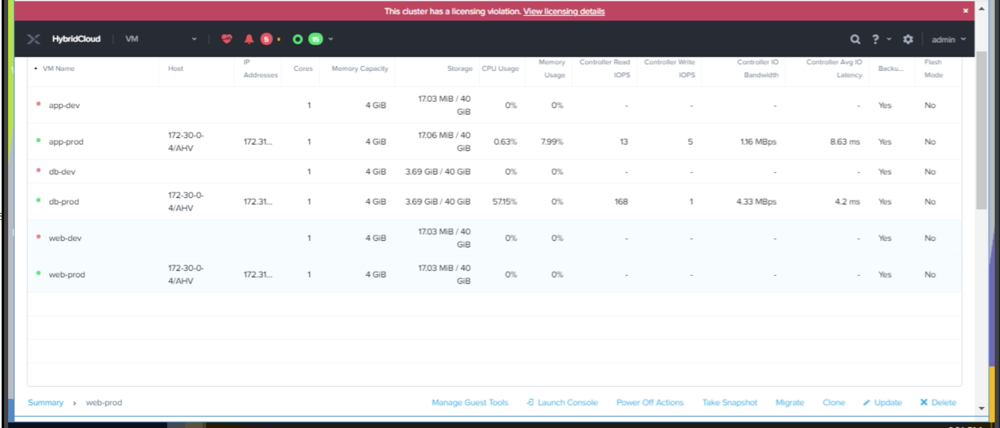
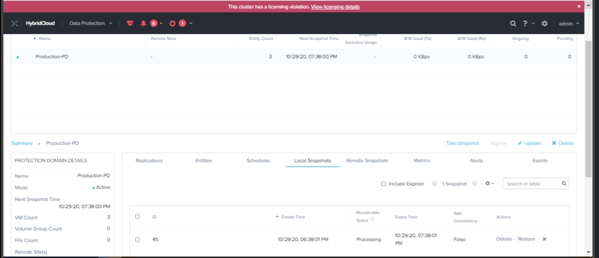
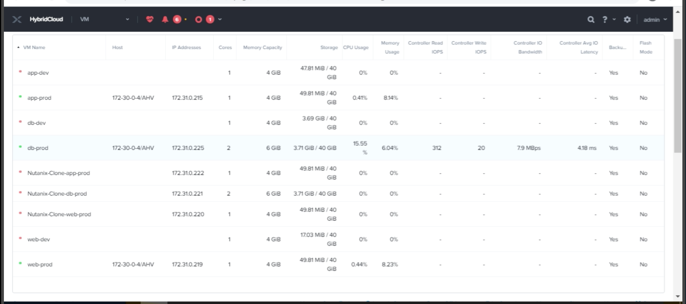

## 1. [Private Cloud Web Application Infrastructure]

 > * Build a Hyperconverged private cloud solution for evaluating a three-tier a web application on a Nutanix HCI cluster. 
 > 
 > * The production environment requires built-in data protection using backup/restore with snapshots and no more than 1 hour of data loss after a failure. Additional tests include VM workload expansion (cloning), the ability to dynamically add CPU/Memory resources to online virtual machines (add 1 vCPU and 2GB memory to the database server). Final verification is the removal of a key VM and performing a full restoration.
 >
 > * The configuration tasks performed on Prism Element are as shown in the screenshots below:
 >
 >
 > 
   

 > #### A. Network configuration:
 >
 > 
 >
  
 

 > #### B. Storage container configuration:
 >
 > 
 >
  

 > #### C. Image configuration:
 >
 > 
 >
  

 > #### D. Prod VM configuration:
 >
 > 
 >
  

 > #### E. Dev VM configuration:
 > 
 > 
 >
  

 
 > #### F. Protection domain configuration:
 > 
 > 
 >
  

 > #### G. Restoration operation:
 > 
 > 
 >
  

 > #### Artifacts: 
 - [Anita-Quevedo-HybridCloud-Nutanix_Cluster_as_Built_2021-03-23_174147.xlsx](https://drive.google.com/file/d/1w-XbVtIhGSnLquf7VFDOjfyLDV5Cu5Hn/view?usp=sharing) 
 
 - [Email CTO](Email_to_CTO.txt)

  

> #### Tools: 
Nutanix Prism Element,  Microsoft Excel, Notepad, Configuration Documenter

