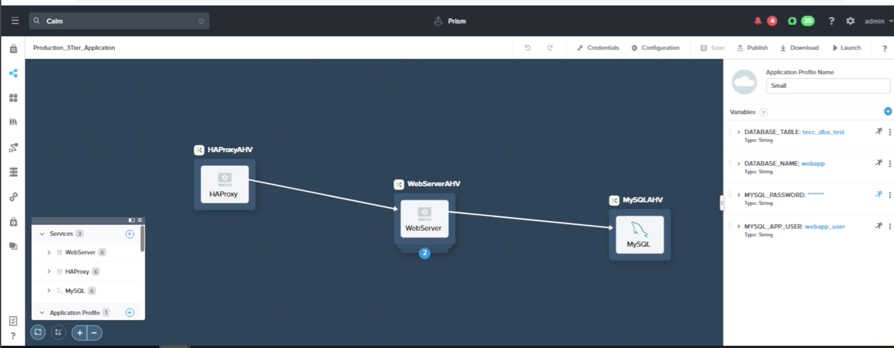
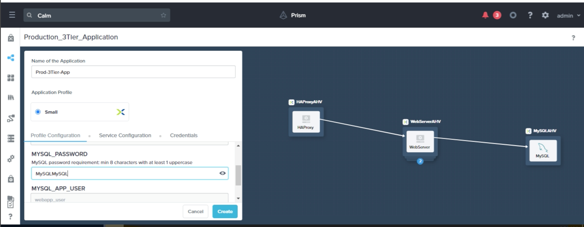
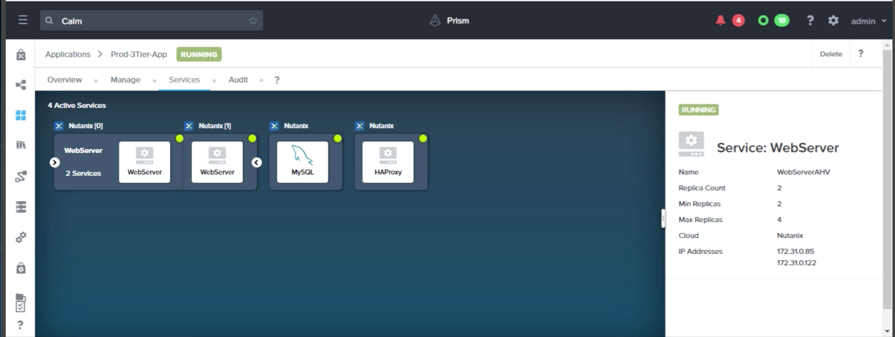
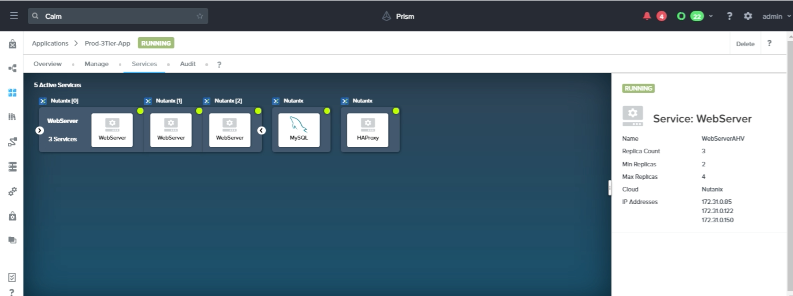

## 2. [Private Cloud SaaS Three-Tier Web Application]

> * Design a blueprint to deploy and configure a three-tier web application with a load balancer, web server, and database VM hosted on the private cloud.
> * Insure each VM in configured with the proper resources and tasks.
> * Test the deployment works with a read and write to the database.
> * Test web tier scaling: scale-in and scale-out actions changing the population by a count of 1.
> * Allow an end user to make a database backup.

> Take screenshots as shown below:
>
> 
> 
> The blueprint can be used to launch a three-tier web application from within Nutanix Calm via a GUI interface:
>
> 
>
> On successfully launched, a three-tier web application with a load balancer, web server and database server is as shown below:
>
> 
>
> The web tier of the web application can be scaled up as shown:
>
>  
>

> #### Tools: 
  Nutanix Prism Central and Calm (Clour Application Lifecycle Management),   Notepad

> #### Artifacts: 
 - [Production-3Tier-Application.json](Production-3Tier-Application.json) 